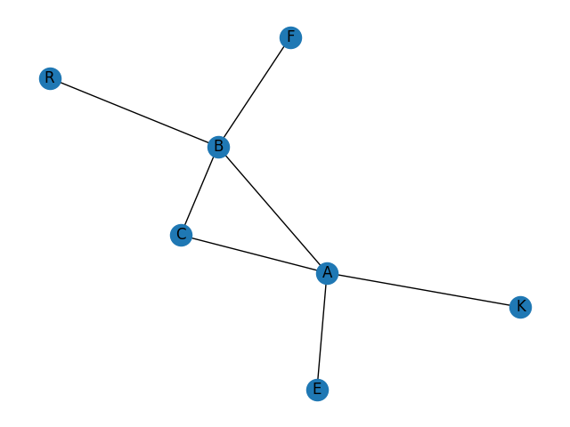

Результати роботи алгоритму DFS:
K A B C F R E 
та BFS:
K A C B E R F

Як видно алгоритм DFS починається з вибраної вершини йде якомога глибше поки можливо, потім відкат назад.
Алгоритм BFS обходить граф по рівнях, спочатку сусіди вершини, потім їхні сусіди.